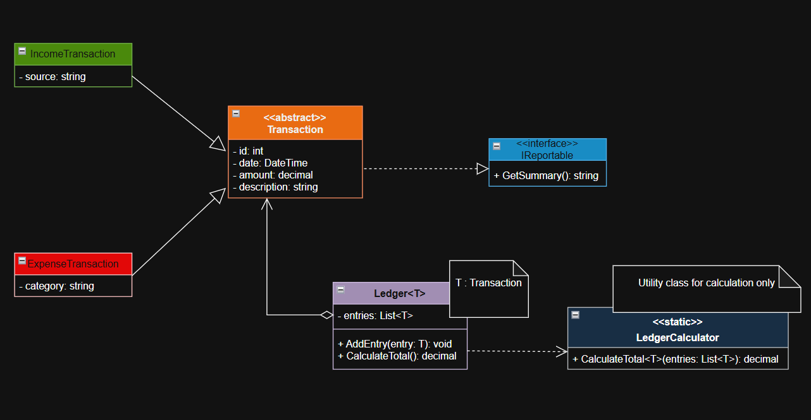

# Digital Petty Cash Ledger System

## 📌 Project Type
**Console-Based Object-Oriented Application (C#)**

---

## 📖 Overview
This project is a **Digital Petty Cash Ledger System** built using **C#** and core **Object-Oriented Programming principles**.  
It allows users to record **income and expense transactions**, calculate totals, and display summaries in a clean and structured manner.

The focus of this project is on:
- Proper system design
- Clean OOP architecture
- UML-to-code mapping
- Maintainable and readable code

---

## 🧱 System Design (UML Class Diagram)

The following UML class diagram represents the overall structure and relationships between the system components:

- Abstract base class for transactions
- Specialized income and expense classes
- Interface for reporting
- Generic ledger with type safety
- Static helper class for calculation

📷 **Class Diagram:**

---

## ⚙️ Key Components

### 🔹 Transaction (Abstract Class)
- Stores common transaction data such as amount, date, and description
- Acts as a base class for all transaction types

### 🔹 IncomeTransaction & ExpenseTransaction
- Extend the Transaction class
- Add specific details like source (income) and category (expense)

### 🔹 IReportable (Interface)
- Enforces reporting behavior
- Enables polymorphism through `GetSummary()`

### 🔹 Ledger<T> (Generic Class)
- Stores transactions in a type-safe manner
- Prevents mixing of different transaction types
- Delegates calculation logic internally

### 🔹 LedgerCalculator (Static Helper Class)
- Performs calculation logic only
- Used inter

